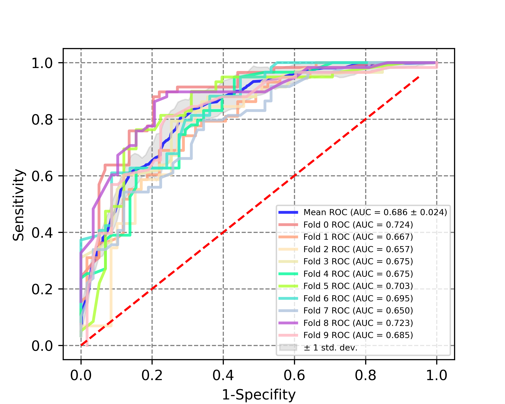
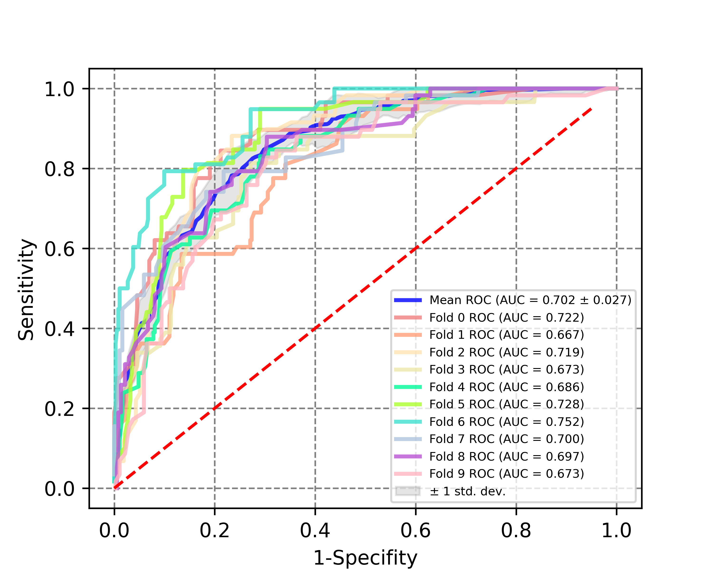
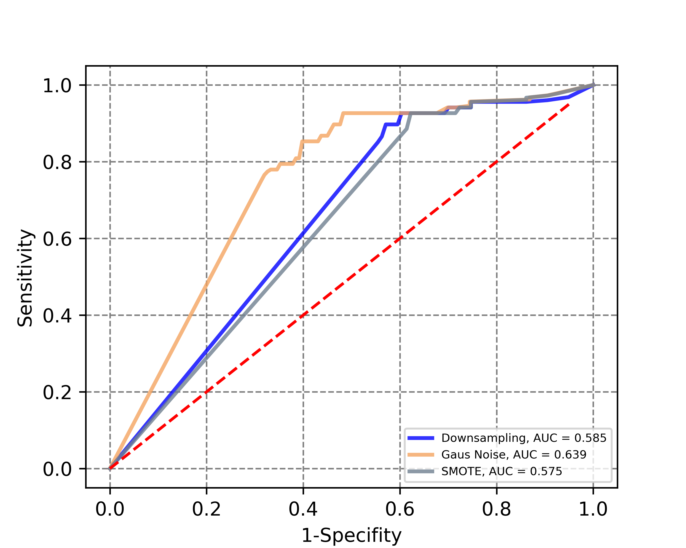

# Diabetes
This repository contains the analysis results for machine learning models using the [diabetes data set](https://www.sciencedirect.com/science/article/pii/S0002870302000698) collected during the Heinz Nixdorf RECALL Study. To obtain access to the data set, the responsible principal investigator has to be contacted. 

# Data 
A detailed description of the data set can be found [here](https://www.sciencedirect.com/science/article/pii/S0933365719301083?via%3Dihub#bib0125). We split the data set into training, validation and test data set. In contrast to the [first analysis](https://www.sciencedirect.com/science/article/pii/S0933365719301083?via%3Dihub#bib0125) of the data set, cross-validation and upsampling techniques were applied to improve the classification performance and avoid overfitting. 

# Getting started
The model used for the predictions is saved in the Diabetes.py file in the src folder. The training routine is described in the training.py file in the src folder. We compared SMOTE, Gausian noise upsampling and downsampling for data stratification. The left image shows the results of the 10-fold cross validation for the downsampling approach and in the right image the results for Gausian noise upsampling can be observed.

  
  

The best fold was used for significance testing using the [DeLong value](https://pubmed.ncbi.nlm.nih.gov/3203132/) on the test set. No significant difference between Gausian noise upsampling and SMOTE could be observed in the analysis. 
The evaluation on the test set is shown in the following image:

## Requirements
The python scripts were tested with following packages and versions: 

   * torch 2.1.0
   * imblearn 0.11.0
   * sklearn 1.2.2
   * pandas 2.0.3
   * numpy 1.26.0
   * pickle 4.0

# Publications
Please cite following publication if you use the results:

# Authors
   * Jan Benedikt Ruhland, jan.ruhland@hhu.de, main contributor
   * Prof. Dr. Dominik Heider, dominik.heider@hhu.de, principal inversitgator

# License
MIT license (see license file). 

# Acknowledgments
We want to thank the German state Hessen for the financial support of the project. Furthermore, the  Marburger Rechen-Cluster 3 (MaRC3) for providing the required computational ressources. 
